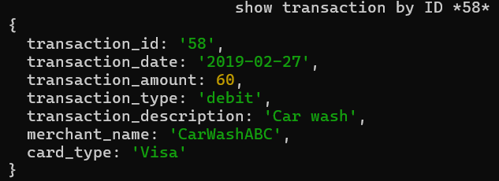

# Запуск проекта 
1) Скачайте или клонируйте репозиторий на личный компьютер
2) Убедитесь, что на вашем копьютере установлен Node.js [link](https://nodejs.org/en)
3) Откройте консоль в папке indv1
4) Запустите консольное приложение командой 
```console
node index.js
```

# Описание индивидуальной работы
Цель: Ознакомиться с основными функциями и с синтаксисом JavaScript на основе консольного приложения для анализа транзакций.

# Краткая документация к проекту
Данный проект показывает в консоли результат операций над транзакциями, взятыми из файла ```transactions.json```
### Классы
1. Transaction
Этот класс описывает одну транзакцию
2. TransactionAnalyzer 
Этот класс анализирует массив транзакций, предоставляя различные методы для анализа данных.

Так же предоставленны примеры использования функционала

# Примеры использования проекта с приложением скриншотов или фрагментов кода

1. Пример создания нового экземпляра класса Transaction и его добавление в список экземпляра класса TransactionAnalyzer
```js
// creating a new custom Transaction to showcase all of the methods created
const new_transaction = new Transaction("999", new Date(), 9999, "new_type", "there is a long long long long description", "Merchant_111", "Visa");
// Adding a new transaction to transactionAnalyzer instance
console.log("\t\t\tadd new Transaction");
console.log(transactionAnalyzer.addTransaction(new_transaction));
```
2. Пример использования функции экземпляра класса TransactionAnalyzer
```js
console.log("\t\t\tshow transaction by ID *58*");
console.log(transactionAnalyzer.findTransactionById("58"));
```


# Ответы на контрольные вопросы
1. Какие примитивные типы данных существуют в JavaScript?
number, string, bigint, undefined, boolean, symbol
2. Какие методы массивов вы использовали для обработки и анализа данных в вашем приложении, и как они помогли в выполнении задачи?
.filter() , .reduce() , .map() , .find() , .sort()
Применение методов массивов значительно уменьшило количество кода и помогло не создавать большое количество переменных, циклов и структур **if** 
3. В чем состоит роль конструктора класса?
Конструктор класса используется для создания новых объектов с определёнными свойствами и методами.
4. Каким образом вы можете создать новый экземпляр класса в JavaScript?
С помощью ключевого слова 
```javascript
new

const class1 = new Class1(*optional args*);
```
# Список использованных источников
[.reduce()](https://developer.mozilla.org/en-US/docs/Web/JavaScript/Reference/Global_Objects/Array/reduce)
[.map()](https://developer.mozilla.org/en-US/docs/Web/JavaScript/Reference/Global_Objects/Array/map)
[constructor](https://developer.mozilla.org/en-US/docs/Web/JavaScript/Reference/Classes/constructor)