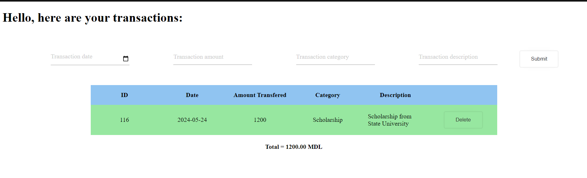
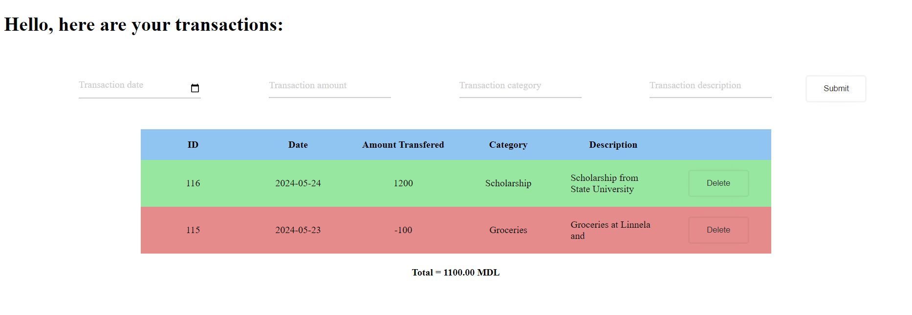
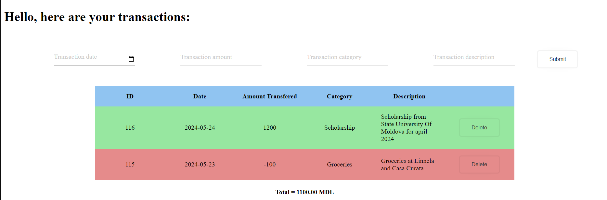
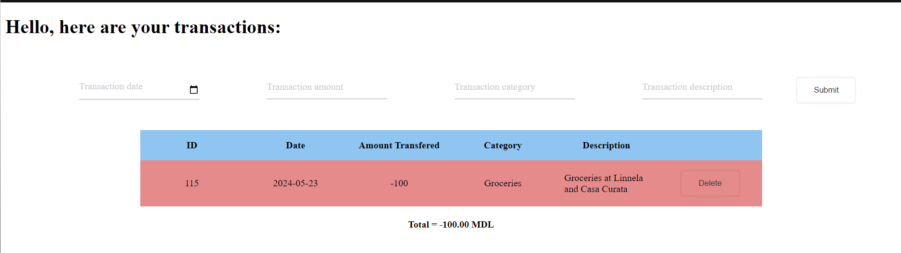

# Запуск проекта 
1) Скачайте или клонируйте репозиторий на личный компьютер
3) Откройте папку indv3
4) Запустите веб приложение, открыв `index.html`

# Описание индивидуальной работы
Цель: Ознакомиться с основными функциями и с синтаксисом JavaScript на основе консольного приложения для анализа транзакций.

# Краткая документация к проекту
Данный проект является веб-приложением для учета личных финансов. 
В основе проекта стоит структура Transactions, над списком из экземпляров которой проводятся операции добавления, удаления и анализа.
### Классы

1. Transaction. Этот класс описывает одну транзакцию:

    `id`: уникальный идентификатор транзакции.

    `date`: дата и время добавления транзакции.

    `amount`: сумма транзакции.

    `category`: категория транзакции.

    `description`: описание транзакции.

### Функции
1.  `addTransaction()` - добавляет транзакцию из формы (форма валидируется на наличие ошибок)
2.  `deleteTransaction()` - удаляет транзакцию из списка и таблицы
3.  `calculateTotal()` - отображает общую сумму транзакций на странице в отдельном элементе.

# Примеры использования проекта с приложением скриншотов или фрагментов кода

1. Пример создания нового экземпляра класса Transaction из формы и его добавление в таблицу
```js
/**
 * Creates a transaction by getiing all of the entries of the form and saving them into the Trasaction object, 
 * then appends the instance to the array
 * Also calls the fuction to create HTML elements to show the new information on page
 * @returns resets the form to empty inputs
 */
function addTransaction() {
    const formData = new FormData(document.getElementById("transactionForm"));
    const transaction = new Transaction();
    transaction.id = getRandomInt(0, 200)
    for (let [key, value] of formData.entries()) {
        if(value=="") return;
        transaction[key] = value;
    }
    transactions.push(transaction);
    createNewRow(transaction);
    document.getElementById('transactionForm').reset();
}
```



2. Пример просмотра полного содержания описания транзакции
```js
[...]
row.onclick = function(){
        row.classList.toggle("show");
        row.classList.contains("show")?  descCell.innerHTML = transaction.description:descCell.innerHTML = transaction.description.split(" ").slice(0, 4).join(" ");
    }
[...]
```

3. Пример удаления транзакции
```js
/**
 * Deletes transaction by id, and updates transactions array to represent the change
 * Also deletes row of the transaction on the page, to represent the change. 
 * Updates total sum of transactioned money
 * @param {number} deleteId - id of the transaction to delete
 */
function deleteTransaction(deleteId){
    transactions = transactions.filter(tr=>tr.id != deleteId)
    const parentDiv =  document.getElementById("transactions").children[0];
    for(var i=0; i< parentDiv.children.length;i++){
        if(parentDiv.children[i].children[0].innerHTML == deleteId)
            document.getElementById("transactions").deleteRow(i);
    }
    calculateTotal();
}
```


# Ответы на контрольные вопросы
1. Каким образом можно получить доступ к элементу на веб-странице с помощью JavaScript?
С помощью document.*метод обращения*
Есть несколько методов для обращения к элементу:
    1. По ID `document.getElementById("id")`
    2. По тэгу `document.getElementById("table")`
    3. По названию класса `document.getElementById("className")`
    4. По селектору (css) `document.querySelector("#idName")` || `document.querySelectorAll(".class")`
2. Что такое делегирование событий и как оно используется для эффективного управления событиями на элементах DOM?
3. Как можно изменить содержимое элемента DOM с помощью JavaScript после его выборки?
С помощью свойства .innerHTML
```js
document.getElementById("id").innerHTML = "<h1>NEW CONTENT</h1>"
```
4. Как можно добавить новый элемент в DOM дерево с помощью JavaScript?
После выборки необходимого элемента, можно добавлять дочерние элементы или соседей спереди или сзади с помощью
`parend.appendChild(newElement)` или `parent.insertbefore(newElement)`
```js
var newElement = document.createElement("div");
var parent = document.body;
parent.appendChild(newElement);
```


# Список использованных источников
[button design](https://uiverse.io/ErzenXz/slimy-chicken-63)

[input design](https://uiverse.io/Satwinder04/pink-bat-77)

[remove placeholder from date input](https://codepen.io/bcalou/pen/bGwJLqO)