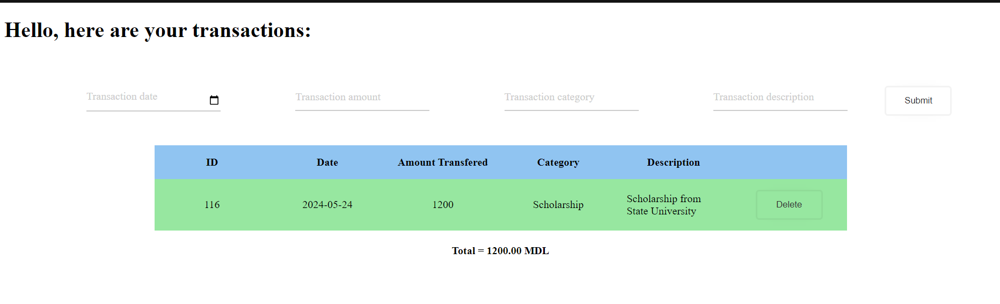
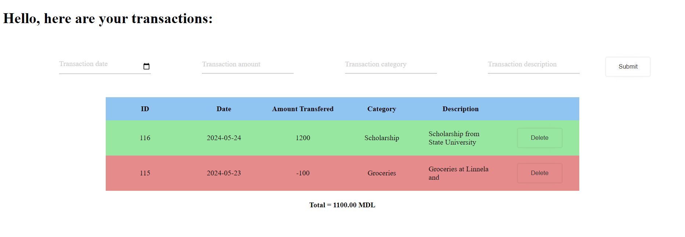
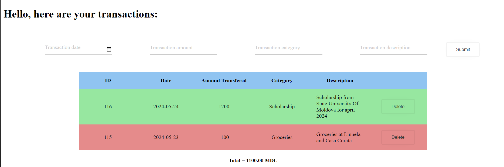
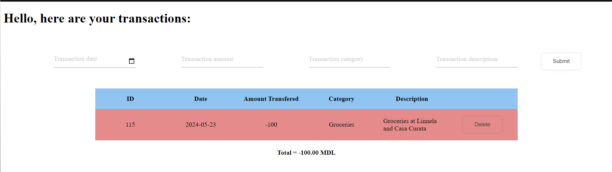

# Запуск проекта 
1) Скачайте или клонируйте репозиторий на личный компьютер
3) Откройте папку indv3
4) Запустите веб приложение, открыв `index.html`

# Описание индивидуальной работы
Цель: Ознакомиться с основными функциями и с синтаксисом JavaScript на основе консольного приложения для анализа транзакций.


## Условия

### Настройка и структурирование проекта

1. Создать файл `index.html`
2. Создать файл `script.js`
3. Создать файл `style.css`
4. Подключить файл со стилями и js-кодом к HTML-странице.

### Представление транзакции

1. Создать массив transactions, который будет содержать объекты транзакций.
2. Каждый объект транзакции должен иметь следующие поля:
   1. `id`: уникальный идентификатор транзакции.
   2. `date`: дата и время добавления транзакции.
   3. `amount`: сумма транзакции.
   4. `category`: категория транзакции.
   5. `description`: описание транзакции.

### Отображение транзакций

1. Создать пустую таблицу, куда в дальнейшем будут добавенны транзакции.
2. Таблица должна содержать следующие столбцы:
   1. ID
   2. Дата и Время
   3. Категория транзакции
   4. Краткое описание транзакции
   5. Действие (кнопка удаления транзакции)

### Добавление транзакций

1. Создать функцию `addTransaction()`,
2. В функции `addTransaction()`:
   1. Создать объект транзакции с данными из формы.
   2. Добавить созданный объект в массив transactions.
   3. Создать новую строку таблицы с данными из объекта транзакции и добавить её в таблицу.
      1. Если транзакция совершена на положительную сумму, то строка таблицы должна быть зеленым цветом, иначе красным.
      2. В колонке `description` отображайте краткое описание транзакции (первые 4 слова).

### Управление транзакциями

1. В каждой строке таблицы добавить кнопку удаления.
2. При клике на кнопку удаления получить идентификатор транзакции и удалить соответствующую строку таблицы и удалить данную транзакцию из массива.
3. Обработчик событий на `клик` на кнопку определить для элемента `<table>`

### Подсчет суммы транзакции

1. Написать функцию `calculateTotal()`, которая будет вызываться после добавления или удаления транзакции.
2. Отобразить общую сумму на странице, в отдельном элементе.

### Отображение полное транзакции

1. В файле index.html создайть блок для отображения подробного описания транзакции.
2. При нажатии на строку с транзакцией в таблице, отобразить полное описание в указанном месте.

### Добавление транзакции

1. Добавить форму на страницу для добавления транзакции в таблицу (для категории используйте select).
2. _Доп. задание_: валидировать форму на наличие ошибок.

# Краткая документация к проекту
Данный проект является веб-приложением для учета личных финансов. 
В основе проекта стоит структура Transactions, над списком из экземпляров которой проводятся операции добавления, удаления и анализа.
### Классы

1. Transaction. Этот класс описывает одну транзакцию:

    `id`: уникальный идентификатор транзакции.

    `date`: дата и время добавления транзакции.

    `amount`: сумма транзакции.

    `category`: категория транзакции.

    `description`: описание транзакции.

### Функции
1.  `addTransaction()` - добавляет транзакцию из формы (форма валидируется на наличие ошибок)
2.  `deleteTransaction()` - удаляет транзакцию из списка и таблицы
3.  `calculateTotal()` - отображает общую сумму транзакций на странице в отдельном элементе.

# Примеры использования проекта с приложением скриншотов или фрагментов кода

1. Пример создания нового экземпляра класса Transaction из формы и его добавление в таблицу
```js
/**
 * Creates a transaction by getiing all of the entries of the form and saving them into the Trasaction object, 
 * then appends the instance to the array
 * Also calls the fuction to create HTML elements to show the new information on page
 * @returns resets the form to empty inputs
 */
function addTransaction() {
    const formData = new FormData(document.getElementById("transactionForm"));
    const transaction = new Transaction();
    transaction.id = getRandomInt(0, 200)
    for (let [key, value] of formData.entries()) {
        if(value=="") return;
        transaction[key] = value;
    }
    transactions.push(transaction);
    createNewRow(transaction);
    document.getElementById('transactionForm').reset();
}
```



2. Пример просмотра полного содержания описания транзакции
```js
[...]
row.onclick = function(){
        row.classList.toggle("show");
        row.classList.contains("show")?  descCell.innerHTML = transaction.description:descCell.innerHTML = transaction.description.split(" ").slice(0, 4).join(" ");
    }
[...]
```

3. Пример удаления транзакции
```js
/**
 * Deletes transaction by id, and updates transactions array to represent the change
 * Also deletes row of the transaction on the page, to represent the change. 
 * Updates total sum of transactioned money
 * @param {number} deleteId - id of the transaction to delete
 */
function deleteTransaction(deleteId){
    transactions = transactions.filter(tr=>tr.id != deleteId)
    const parentDiv =  document.getElementById("transactions").children[0];
    for(var i=0; i< parentDiv.children.length;i++){
        if(parentDiv.children[i].children[0].innerHTML == deleteId)
            document.getElementById("transactions").deleteRow(i);
    }
    calculateTotal();
}
```


# Ответы на контрольные вопросы
1. Каким образом можно получить доступ к элементу на веб-странице с помощью JavaScript?

    С помощью document.*метод обращения*
    Есть несколько методов для обращения к элементу:
     1. По ID `document.getElementById("id")`
     2. По тэгу `document.getElementById("table")`
     3. По названию класса `document.getElementById("className")`
     4. По селектору (css) `document.querySelector("#idName")` || `document.querySelectorAll(".class")`.

2. Что такое делегирование событий и как оно используется для эффективного управления событиями на элементах DOM?

    Способ обработки событий, которая может сократить количество написанных обработчиков событый. Чаще всего применяется, когда в одном блоке есть много одноуровневых кликабельных элементов. `event.target` помогает определить какой именно элемент вызвал событие.
    Например, можно  к элементу `div`, который содержит в себе много `p` элементов применить обработчик событий на `click`, и не придется писать через цикл обработчик события для всех тэгов `p` родительского элемента.  

3. Как можно изменить содержимое элемента DOM с помощью JavaScript после его выборки?

    С помощью свойства `.innerHTML`.
    ```js
    document.getElementById("id").innerHTML = "<h1>NEW CONTENT</h1>"
    ```

4. Как можно добавить новый элемент в DOM дерево с помощью JavaScript?

    После выборки необходимого элемента, можно добавлять дочерние элементы или соседей спереди или сзади с помощью.
    `parend.appendChild(newElement)` или `parent.insertbefore(newElement)`
    ```js
    var newElement = document.createElement("div");
    var parent = document.body;
    parent.appendChild(newElement);
    ```


# Список использованных источников
* [button design](https://uiverse.io/ErzenXz/slimy-chicken-63)
* [input design](https://uiverse.io/Satwinder04/pink-bat-77)
* [remove placeholder from date input](https://codepen.io/bcalou/pen/bGwJLqO)